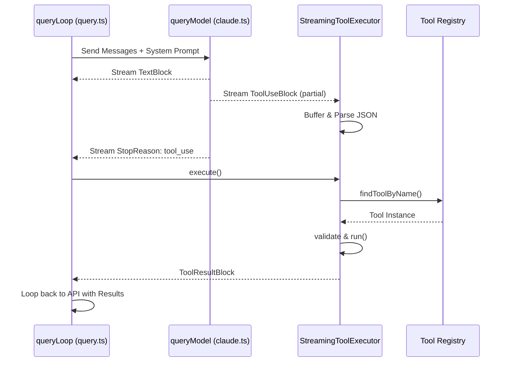
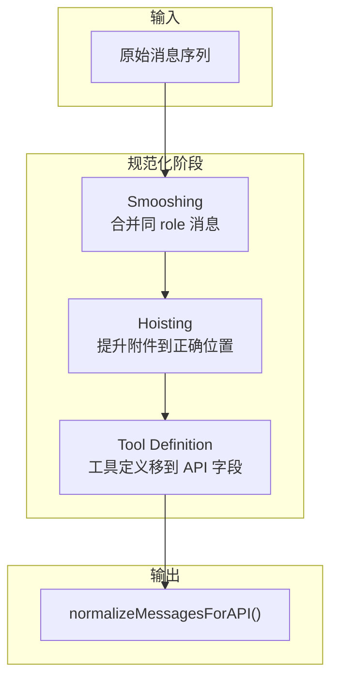
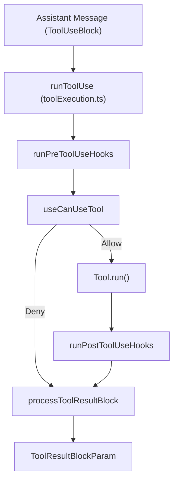
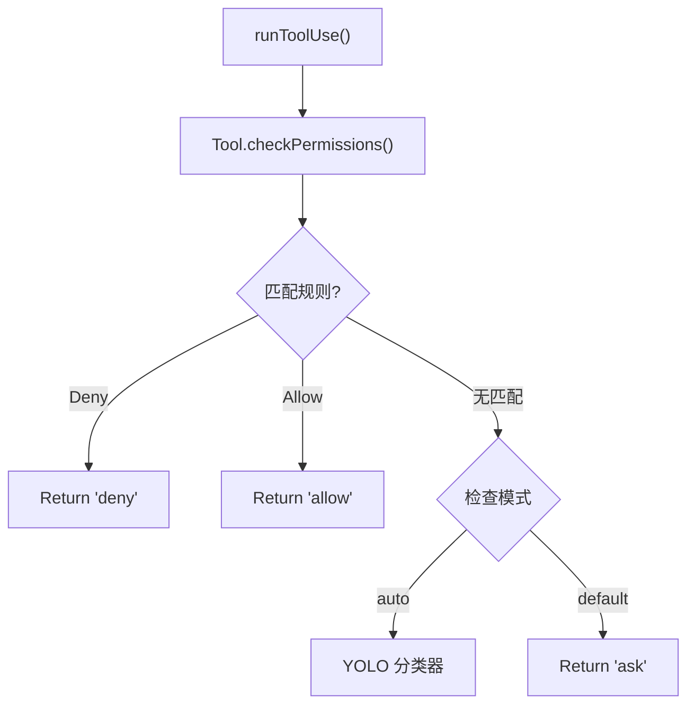
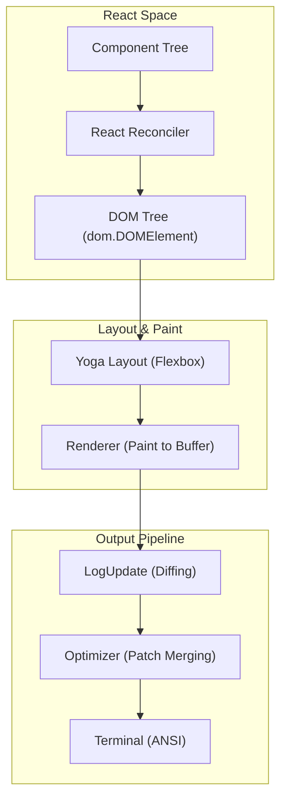
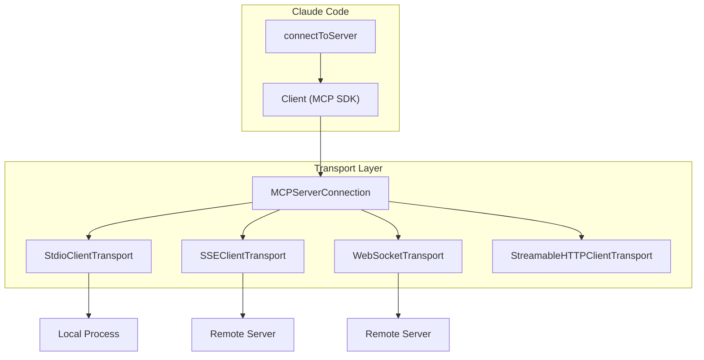

# SinghCoder/claude-code 架构详解

> 基于 DeepWiki 深度分析的 Claude Code 完整实现

---

## 目录

1. [核心架构总览](#1-核心架构总览)
2. [Agentic Loop](#2-agentic-loop)
3. [消息规范化与上下文管理](#3-消息规范化与上下文管理)
4. [工具执行管道](#4-工具执行管道)
5. [权限系统](#5-权限系统)
6. [多 Agent 系统](#6-多-agent-系统)
7. [终端 UI (TUI)](#7-终端-ui-tui)
8. [记忆系统](#8-记忆系统)
9. [MCP 协议支持](#9-mcp-协议支持)

---

## 1. 核心架构总览

```
User Input → queryLoop() → normalizeMessagesForAPI() → Claude API
                                                       ↓
                                                  Model Reasoning
                                                       ↓
                                                  runTools()
                                                       ↓
                                                  queryLoop() ← Context Full? → compact()
```

**核心文件：** `src/query.ts`

---

## 2. Agentic Loop

### 2.1 Query Loop 工作流程

```
┌─────────────────────────────────────────────────────────────────┐
│                      Query Entry & Guard                        │
├─────────────────────────────────────────────────────────────────┤
│  User Input → messageQueueManager.enqueue()                     │
│                    ↓                                             │
│  processQueueIfReady() → QueryGuard.reserve()                   │
│                    ↓                                             │
│  QueryGuard.status: "dispatching" → executeQueuedInput()        │
│                    ↓                                             │
│  QueryGuard.status: "running" → queryLoop()                    │
└─────────────────────────────────────────────────────────────────┘
```

### 2.2 工具调用循环



### 2.3 Token 预算管理

| 触发条件 | 策略 | 实现 |
|---------|------|------|
| **Budget 充足** | 提示 "Keep working" | `COMPLETION_THRESHOLD` (90%) |
| **递减回报** | 强制停止 | `DIMINISHING_THRESHOLD` |
| **预算耗尽** | 注入 nudge messages | `getBudgetContinuationMessage` |

### 2.4 压缩策略

| 策略 | 类型 | 实现 |
|------|------|------|
| **Microcompact** | 非破坏性 | `createMicrocompactBoundaryMessage` |
| **Autocompact** | 摘要式 | `calculateTokenWarningState` |
| **History Snip** | 破坏性 | `snipCompact.ts` |
| **Reactive Compact** | 恢复式 | API 返回 413 时触发 |

### 2.5 Fallback 模型机制

- **FallbackTriggeredError**: 当主模型（Sonnet）过载时触发
- 自动切换到 "Small Fast Model" (Haiku) 或 "High Capacity Model" (Opus)
- Post-Sampling Hooks: 签名剥离、输出修改、停止序列处理

---

## 3. 消息规范化与上下文管理

### 3.1 消息规范化流程



### 3.2 上下文窗口管理

- **Attachment Bubbling**: 用户附件被提升到消息数组的正确位置
- **Compaction 触发**: 每个 API 调用前检查 `isAutoCompactEnabled()`
- **压缩后重建**: `buildPostCompactMessages` 重建对话历史

---

## 4. 工具执行管道

### 4.1 执行流程



### 4.2 权限处理

| Handler | 用途 | 场景 |
|---------|------|------|
| **InteractiveHandler** | 弹出 TUI 确认框 | 标准 CLI 会话 |
| **CoordinatorHandler** | 等待后台分类器 | `awaitAutomatedChecksBeforeDialog` |
| **SwarmWorkerPermission** | 子 Agent 权限 | 多 Agent 系统 |

### 4.3 Hook 生命周期

| Hook 事件 | 时机 | 用途 |
|----------|------|------|
| `PreToolUse` | 权限检查前 | 修改输入或阻塞执行 |
| `PostToolUse` | 成功执行后 | 转换输出或触发副作用 |
| `PostToolUseFailure` | 执行抛出异常 | 错误处理 |
| `PermissionDenied` | 分类器拒绝后 | 通知外部系统 |

### 4.4 UI 优化：读取/搜索折叠

- **Search**: `GrepTool`, `GlobTool`, `BashTool` (`ls`, `find`)
- **Read**: `FileReadTool`
- **Memory Ops**: `MEMORY.md` 操作被视为可折叠
- **Silent Absorbs**: `ToolSearchTool`, `SnipTool` 被静默吸收

---

## 5. 权限系统

### 5.1 权限模式

| 模式 | 描述 |
|------|------|
| `default` | 标准交互模式，写操作需手动批准 |
| `plan` | 规划模式，大多数副作用工具禁用 |
| `auto` | YOLO 分类器自动决定 |
| `acceptEdits` | 自动批准所有文件系统编辑 |
| `bypassPermissions` | **危险**：自动批准所有操作 |

### 5.2 规则语法

```
ToolName(pattern)
```

- **前缀匹配**: `Bash(npm install:*)`
- **Glob**: `FileReadTool(src/**/*.ts)`
- **MCP 规则**: `mcp__server__tool`

### 5.3 权限决策流程



### 5.4 YOLO 分类器

```typescript
//  especulative check - 与 UI 渲染并行运行
useCanUseTool.tsx:126-135
```

---

## 6. 多 Agent 系统

### 6.1 Agent 类型

| 类型 | 创建方式 | 上下文 |
|------|---------|--------|
| **Fresh Subagent** | 指定 `subagent_type` | 零上下文，继承环境 |
| **Forked Subagent** | 省略 `subagent_type` | 复制当前会话状态 |
| **Resumed Agent** | `resumeAgent()` | 从持久化状态恢复 |

### 6.2 Agent 生命周期状态机

```mermaid
graph TD
    "Start" --> "spawnTeammate()"
    "spawnTeammate()" --> "Init"
    "Init" --> "registerAsyncAgent()"
    "registerAsyncAgent()" --> "Running"
    "Running" -->|"registerAgentForeground()"| "Foreground"
    "Running" -->|"unregisterAgentForeground()"| "Background"
    "Running" -->|"completeAgentTask()"| "Completed"
    "Running" -->|"failAgentTask()"| "Failed"
    "Completed" --> "finalizeAgentTool()"
    "Failed" --> "finalizeAgentTool()"
```

### 6.3 跨 Agent 通信

- **Mailbox 系统**: `SendMessageTool` 发送消息
- **消息持久化**: 写入 teammate 的 mailbox 文件
- **Abort 传播**: `AbortController` 信号传播到所有子 Agent

### 6.4 Sidechain Transcripts

子 Agent 活动记录在"侧链" transcripts 而非主会话历史，防止上下文窗口膨胀。

---

## 7. 终端 UI (TUI)

### 7.1 Ink 渲染引擎架构



### 7.2 Yoga 布局引擎

- 纯 TypeScript 实现的 CSS Flexbox 子集
- 支持 `flex-direction`, `flex-grow`, `align-items`, `justify-content`
- Measure Functions 用于文本节点的动态高度计算
- 布局缓存优化 (`_hasL` 单槽缓存)

### 7.3 双缓冲与 Damage Tracking

1. **Screen Buffers**: `frontFrame` 和 `backFrame`
2. **Diffing**: `LogUpdate` 比较帧差异
3. **Patches**: 只发送差异（`cursorMove`, `styleStr`, `stdout`）
4. **优化**: 相邻 patches 合并

### 7.4 自愈终端状态

- **DEC 2026**: 同步输出模式，原子化帧渲染
- **Stdin Resume**: 5 秒静默后重新断言终端模式
- **Alternate Screen**: 文本选择、鼠标悬停、光标停放

---

## 8. 记忆系统

### 8.1 记忆分类

| 类型 | 用途 | 描述 |
|------|------|------|
| `user` | 用户信息 | 角色、专业水平、偏好 |
| `feedback` | 反馈 | 用户对 Agent 行为的指导 |
| `project` | 项目 | 非可推导的上下文（deadline、stakeholder） |
| `reference` | 参考 | 外部文档链接 |

### 8.2 MEMORY.md 索引

```
- [Title](file.md) — one-line hook
```

- 最多 200 行或 25KB
- 超限时追加 `> WARNING` 提示 Agent 精简

### 8.3 记忆提取子 Agent

- **约束工具**: `FileReadTool`, `GrepTool`, `GlobTool`, 只读 `BashTool`
- **效率策略**: Turn 1 并行读取，Turn 2 并行写入

### 8.4 Team Memory 安全

路径验证流程：
1. **迭代解析**: 从目标路径向上查找存在的目录
2. **符号链接检测**: `realpath()` 解析所有符号链接
3. **悬空链接检查**: `lstat()` 拒绝悬空符号链接
4. ** containment 检查**: 确保解析后的路径在授权目录内

---

## 9. MCP 协议支持

### 9.1 支持的传输类型

| 传输类型 | 实现 | 用途 |
|---------|------|------|
| **Stdio** | `StdioClientTransport` | 本地可执行服务器 |
| **SSE** | `SSEClientTransport` | 远程服务器的 Server-Sent Events |
| **HTTP** | `StreamableHTTPClientTransport` | 标准 Web MCP 服务器 |
| **WebSocket** | `WebSocketTransport` | 全双工持久连接 |
| **Claude.ai Proxy** | `claudeai-proxy` | Anthropic 管理的 MCP 服务器 |

### 9.2 MCP 客户端架构



### 9.3 会话与认证

- **OAuth 刷新**: `checkAndRefreshOAuthTokenIfNeeded`
- **会话过期**: `McpSessionExpiredError` 触发重连
- **URL 采集**: 服务器可请求用户通过 TUI 提供配置

### 9.4 输出持久化与截断

1. **大小估计**: `getContentSizeEstimate`
2. **截断**: `truncateMcpContentIfNeeded`
3. **二进制持久化**: `persistBinaryContent` 或 `persistToolResult`
4. **指针替代**: 模型收到指向和访问说明，而非完整内容

---

## 总结：核心设计模式

| 模式 | 应用 |
|------|------|
| **异步生成器** | `queryLoop` 流式返回 `StreamEvent` |
| **状态机** | Agent 生命周期、权限模式 |
| **双缓冲** | TUI 渲染、Damage Tracking |
| **Hook 生命周期** | 工具执行扩展点 |
| **Sidechain** | 子 Agent 上下文隔离 |
| **Mailbox** | 跨 Agent 通信 |
| **Token Budget** | 成本控制与连续性 |
| **Compaction** | 上下文窗口管理 |
